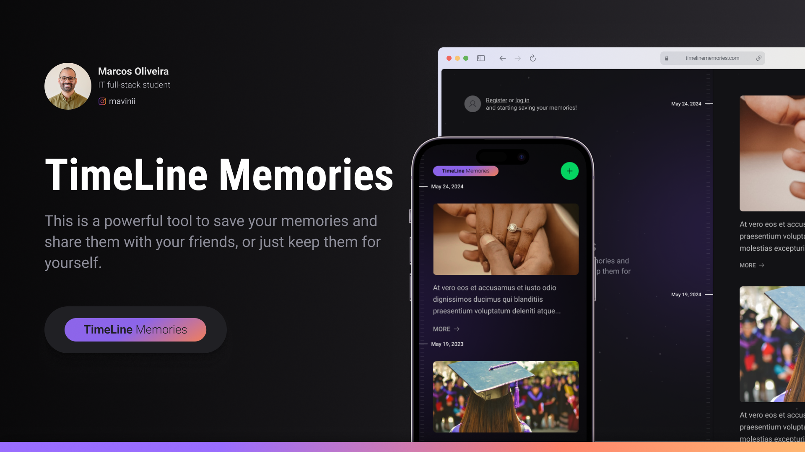

  <h1 align="center">TimeLine Memories</h1>

  

## About
This is a full-stack project, from back-end to mobile, created to learn more about `React`, `React Native`, `NextJS`, `Tailwind`, `Node`, `TypeScript`, `Prisma`, `Expo` and so much more!

## Back-end
- NodeJS
- Typescript + TSX
- Fastify
- ESLint
- Prisma + SQLite

Clique [here](#) to see the Back-end documentation.

## Front-end
- ReactJS + NextJS
- TailwindCSS
- ESLint + Prettier Tailwind`

Clique [here](#) to see the Front-end documentation.

## Mobile
- Expo
- NativeWind
- ESLint + Prettier Tailwind

Clique [here](#) to see the Mobile documentation.

## Run the App
- /web:
> npm run dev

- /mobile:
> expo start

- /server:
> npm run dev

## References
This project was possible thanks to the `#NLW` from `RocketSeat` community, which is a community of developers who are always looking to improve their skills and help each other.
- [RocketSeat](https://rocketseat.com.br/)

## Copyright Disclaimer
Please note that this project is non-profit or not intended to be monetized.

---

<strong>Built with 💙 by [@Marcos Oliveira](https://www.linkedin.com/in/pgmarcosoliveira/)</strong>